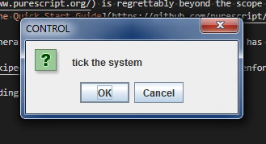

This document leads the reader through developing a "parrot" with this system.
It's intended for readers familiar with functional programming,(but possibly lapsed) and "comfortable with Google"<sup id='f_link1'>[1](#f_note1)</sup> but not necessarily experienced with Haskell / PureScript.
It is assumed that [the steps to install the system have been followed](INSTALL.md) first.

> Candidly; don't hand this to an undergraduate and expect them to be able to grok it without help.

# Parrot

- [Empty Agent](#empty-agent)
- [Hello Log Agent](#hello-log-agent)
	- [Log Columns](#log-columns)
	- [Sending a Message](#sending-a-message)
	- [Cycle Counter](#cycle-counter)
		- [Count](#count)
- [Listening for Speech](#listening-for-speech)
	- [Event and Sample Inputs (Background)](#event-and-sample-inputs-background)
	- [Open the Foreign Systems](#open-the-foreign-systems)
		- [Import Required Functionality](#import-required-functionality)
		- [Open the Signal Functions](#open-the-signal-functions)
		- [Check that Errors Trigger](#check-that-errors-trigger)
	- [Connect the Microphone to the ASR](#connect-the-microphone-to-the-asr)
	- [Logging ASR Values](#logging-asr-values)
- [Speaking Out](#speaking-out)
	- [The Brain](#the-brain)
	- [Implementing the "Brain"](#implementing-the-brain)
	- [Integrating the brain](#integrating-the-brain)
	- [Summary](#summary)
- [Google ASR](#google-asr)

This is a tutorial for creating a "parrot" that repeats (in English) whatever speech it recognises (of English) using this Interactive Artificial Intelligence tool.
I am assuming that [you have installed the system already and it's working - here's a guide to do that](INSTALL.md) and are somewhat comfortable using PureScript.<sup id='f_link2'>[2](#f_note2)</sup>
You'll need a text editor, I'm using [Visual Code](https://code.visualstudio.com/)<sup id='f_link3'>[3](#f_note3)</sup> with the [PureScript Language Support](https://marketplace.visualstudio.com/items?itemName=nwolverson.language-purescript) installed.

> PureScript uses [the "off-side rule"](https://en.wikipedia.org/wiki/Off-side_rule) and (sensibly) enforces the indentation character.
>
> If you use a `\t` you will get a compiler error reading `Illegal whitespace character U+0009`.

## Empty Agent

Open the `fud14.pure-gen.sbt/` folder and run `sbt demo/run` at the command line.

> If you're using VSCode, and you've opened that folder; you can type `CTRL + SHIFT + B` and select `full build & run ; sbt demo/run` to do a "full build" from the popup menu.
>
> There are simpler approaches - but - we need to fully build it.

After a few moments of compiling, a Java Swing window will appear ...



... indicating that the system is up and running.
Double-check that the agent works and recognises a word or two.
Check for any error messages, and see if the ASR notices when you speak.

> The CMU Sphinx4 ASR is imprecise, but, easy to set up - so it's used here.

Now, open the `fud14.pure-gen.sbt/demo/iai/Agent.purs` file - we'll end up with a different version.
Replace ALL OF the contents with ...

```purescript
module Agent where
```

... and ONLY this to make technically correct `module` but one that won't work.
Re-check this with `CTRL + SHIFT + B` and select `re-check the PureScript ; spago demo/build` to do *just* that.
The output from the process should look like the below message.

```
> Executing task: spago -C bundle-module <

[error] Executable was not found in path: "purs"
[info] Installation complete.
Compiling Agent
Compiling Main
Error found:
in module Main
at D:/VitualPeter/fun/fud14.pure-gen.sbt/lib/Main.purs:15:15 - 15:20 (line 15, column 15 - line 15, column 20)

  Cannot import value entry from module Agent
  It either does not exist or the module does not export it.

See https://github.com/purescript/documentation/blob/master/errors/UnknownImport.md for more information,
or to contribute content related to this error.

[error] Failed to build.

Terminal will be reused by tasks, press any key to close it.
```

> The line `[error] Executable was not found in path: "purs"` is a Windows/PureScript/Spago thing - please don't worry.
>
> > ... but if you want to file PureScript/Spago GitHub tickets asking for it to be fixed; it'd lend weight to the argument that it should be fixed.

The important detail is these two lines.
```
Cannot import value entry from module Agent
It either does not exist or the module does not export it.
```

Simply put, the provided `Main.purs` file tried to compile/import our `Agent.purs` module and didn't find a function `entry :: Effect (SF Unit Unit)`.

> This is the function we just deleted.

Making an empty (but valid) agent is simple.
Add a function prototype `entry :: Effect (SF Unit Unit)` to `Agent.purs` to give it the correct type.
The file `fud14.pure-gen.sbt/demo/iai/Agent.purs` still won't work-work, but, should look like this;

```purescript
module Agent where

entry :: Effect (SF Unit Unit)
```

When you "check" the system again, you'll get a different error saying `The type declaration for entry should be followed by its definition`.
PureScript needs a function body to follow the type, so, we need to *create a function* that *returns an effect* of *creating a signal-function* value.

```purescript
entry = do
  pure (Wrap (\_ -> unit))
```

This can be simplified using the `$` operator which, for most purposes, acts as a "left bracket" `(` which lasts until the end of line or the first `)`.
These lines are equivalent;

- `pure ( Wrap ( \_ -> unit))`
- `pure ( Wrap $ \_ -> unit)`
- `pure ( unitsf )`
- `pure   unitsf`

It's worth noting that this **do-notation** is a PureScript (et al) construct to help define an `Effect`.
  This notation provides syntactical sugar to make it simpler and cleaner to define certain constructs.
PureScript is (not TypeScript or JavaScript and) a pure functional programming language.

- all code is a "function" in the mathematical sense
  - some things are not functions, like type definitions
- functions compute values
  - sometimes these values are functions
- we have `Effect` to build things happening outside of the program
  - these are manipulated as a type monad which is outside of the scope of this document and knowledge
- *do-notation* and `pure` are used to build a function which has this `Effect`

In a more practical sense, pure has a signature `pure :: forall a. a -> Effect a` and works like C's `return` ... sort of.
For any `value : a` you can pass it through `pure` to produce a value of type `Effect a`.

`Wrap :: forall i o. (i -> o) -> SF i o` is a constructor (from the `lib/FRP.purs` file) that *wraps* an otherwise "pure function" to be a signal function.<sup id='f_link4'>[4](#f_note4)</sup>

The `\_ -> unit` statement is a function that takes any value and returns a/the value of type `Unit`.
It is semantically identical to the snippet below ...

```purescript
foo :: forall i. i -> Unit
foo _ = unit

unitsf :: forall i. SF i Unit
unitsf = Wrap foo
```

... and the "builtin" function `unitsf` in `FRP.purs` does exactly this.

The type `Unit` is somewhat equivalent to `void` from C, and instances of `: Unit` are constructed/accessed by `unit :: Unit` here.
This sort of *empty computation* has little value itself, but, is useful when we want something like an `Effect` or (here) a `SF () ()` that can carry `Effect`computes no value.
Whenever a `void` method is called in C++/Java/CSharp/ECMAScript - we don't care about the value that's computed, we care about the side effects that are caused.
Saying "this function has side effects outside of the system" in PureScript is done with a do-notation and a block of the type `Effect`.

... anyway, **check** the demo again ...

If you see an error message `Illegal whitespace character U+0009` you have indented with a `\t`.
PureScript doesn't like `\t` so find it and turn any `\t` into a pair of spaces.

If you don't have a `\t` you'll just see an error of `Unknown type Effect` because you need to import `Effect`.
**THIS IS GOOD** and indicates progress.
Add `import Effect` `import FRP` and `import Prelude` so that your file looks like this ...

```purescript
module Agent where

import Effect
import FRP
import Prelude

entry :: Effect (SF Unit Unit)
entry = do
  pure unitsf
```

... and when you **check** it again, you'll see three warning message, and the "Windows can't find `purs`" message but it'll end with ...

```
[info] Build succeeded.
[info] Bundling first...
[info] Bundle succeeded and output file to index.js
[info] Make module succeeded and output file to index.js

Terminal will be reused by tasks, press any key to close it.
```

... indicating that the PureScript module compiled.
We can now "run" it be typing `CTRL + SHIFT + B` and selecting the "full build & run" option.
After a slower (and more strenuous) build - you will see the CONTROL window again.

We're almost at a "Hello World" agent.

## Hello Log Agent

While a skilled (or stubborn) programmer could include a way to *just* write out messages to the console, this would be analogous to "fighting the system" with C/++ by casting `const` data to be mutable.
The intended approach for things like log messages would be to compute and assign a "column" value for each "cycle" of the agent and system.
One could consider each "cycle" of the system to be a row in a table or spreadsheet.
Each cycle includes a column with values for each foreign signal function carrying data in or out of the agent.

The *agent* is the (PureScript) program we're writing that reads and sends data to components.
Each output from the agent is referred to as a signal.
In this section, we will alter the empty agent we've produced to emit a simple "log column" type of signal.
This column will have a name and, after each "frame" the system will print the value of this column to STDIO.
To make the thing "interesting," once it works we will program and use a counter to display the "iteration number" in the log message.

### Log Columns

LogColumns are output from the agent.
Any output (or input) from the components is implemented with **foreign signal functions** which communicate the data to the agent.
These are so named as (from PureScript's perspective) they are invoking a *[foreigh function interface call](https://en.wikipedia.org/wiki/Foreign_function_interface)*.
To a developer (such as the reader reading this document) this is somewhat analogous to a filehandle or a network socket with a more specific API.
These *foreign signal functions* are *opened* at agent setup, and have a value put into it at each cycle.

Start by adding `hello <- openLogColumn "hello"` to the line after `do` in the agent to open our logging column.
This function comes from the `S3.Scenario` module, so, we need to `import S3.Scenario` to access it.

```purescript
module Agent where

import Effect
import FRP
import Prelude

import S3.Scenario -- import the LogColumn functions

entry :: Effect (SF Unit Unit)
entry = do
  hello <- openLogColumn "hello" -- open the log column
  pure unitsf
```

When you run the agent, you'll see the usual warnings, the system will run (as before) but will immediately halt with a new exception ...

```
>>>>>>>>>>>>>>>>>>>>>>>>>>>>>>>>>>>>>>
!
! requirement failed: no data attached to Scenario/LogColumn(hello) likely; it was not called
!
======================================
======================================
java.lang.IllegalArgumentException: requirement failed: no data attached to Scenario/LogColumn(hello) likely; it was not called
        at scala.Predef$.require(Predef.scala:281)
        at peterlavalle.puregen.core.AComponent$BehaviourAtomic.cycleComplete(AComponent.scala:180)
        at peterlavalle.puregen.BuiltIn$.$anonfun$apply$6(BuiltIn.scala:67)
        at peterlavalle.puregen.BuiltIn$.$anonfun$apply$6$adapted(BuiltIn.scala:67)
        at scala.collection.Iterator.foreach(Iterator.scala:941)
        at scala.collection.Iterator.foreach$(Iterator.scala:941)
        at scala.collection.AbstractIterator.foreach(Iterator.scala:1429)

```

This indicates that one of the outputs (specifically the **Scenario/LogColumn(hello)**) wasn't "written to" during the cycle.
Each output (and input) needs to be accessed once (and only once) every cycle.
This is "enforced" to be sure that the agent is functioning as intended.
So, we need to set or send a log value for `"hello"` each cycle.

### Sending a Message

Right now the agent opens (but doesn't use) `hello <-` which has the form `: SF String Unit`.
We need to connect some signal function of the form `: SF Unit String` to it and create a signal function `SF Unit Unit`.
Once this is done, we can return it with `pure` instead of the placeholder `unitsf`.
Two signal functions can be combined with the `concat` function or `>>>>` operator.

```purescript
concat :: forall i m o. SF i m -> SF m o -> SF i o
infixr 7 concat as >>>>
```

Which takes two functions ...


... and creates a new one ...


So, if we had a constructor `messages :: SF Unit String`, we could compose it with the `hello` and return the result value with `pure`
Let's add this at the end of the agent in a `where` block to check the types.
Add it with a *typed hole*<sup id='f_link5'>[5](#f_note5)</sup> first and then build it to see what happens ...

```purescript
module Agent where

import Effect
import FRP
import Prelude

import Pdemo.Scenario

entry :: Effect (SF Unit Unit)
entry = do
  hello <- openLogColumn "hello"
  pure (message >>>> hello) -- use our hole

  -- add a where block with "typed hole"
  where
    message:: SF Unit String
    message = ?todo
```

... which fails to build with an error message ...

```
Error found:
in module Agent
at C:\Users\Peter\Desktop\portfolio-fun\fud14.pure-gen.sbt\demo\iai\Agent.purs:18:15 - 18:20 (line 18, column 15 - line 18, column 20)

  Hole 'todo' has the inferred type

    SF Unit String

  You could substitute the hole with one of these values:

    message  :: SF Unit String

in value declaration entry

See https://github.com/purescript/documentation/blob/master/errors/HoleInferredType.md for more information,
or to contribute content related to this error.

[error] Failed to build.
```

... great.
Really - this is just the compiler saying "Your program is fine, but, I can't work with this thing so I need you to fill it in."
We can "fill in" this hole<sup id='f_link5'>[5](#f_note5)</sup> to build a result that works.
So, all that needs to be done is to replace `?todo` with something that emits a suitable string value.

We've already seen how to do this with `unit :: Unit` above, so, we *could* just do this ...

```purescript
message = Wrap (\_ -> "Hello World")
```

... and get the agent to emit the message.
But, there's a builtin function `consta :: forall i o. o -> SF i o` we could also use.

```purescript
message = consta "Hello World"
```

It has the same effect, but, is shorter so is preferable.
If you run this now, and press the "OK" button a few times, you should get;

```
creating the entry signal-function
[hello] @ 0.0
[hello]: Hello World
[hello] @ 19.85
[hello]: Hello World
[hello] @ 21.935
[hello]: Hello World
[hello] @ 22.111
[hello]: Hello World
```

So, that's us saying "Hello World" with an Interactive Artificial Intelligence.

### Cycle Counter

As a final step in this lesson, let's add a cycle count to the "Hello Log."
Just something that emits a new number each cycle so that the messages are different.
This will take the form of replacing the `message :: SF Unit String` function.
We'll do this in two steps;

1. create a signal function `: SF Unit Int` that performs the "counting"
2. concatenate it with a `Int -> String` function via `Wrap`

#### Count

The author expected that the pattern ...

%20=%20\left(p_1,%20o\right))

... would be commonly used.
That is, for some known value  a function ) would be known to produce an output pair ) containing both the next value  and the output value for .
A PureScript constructor is included of the form `fold_soft :: forall p i o. p -> (p -> i -> (Tuple p o)) -> SF i o` to build these entitites.
We'll need to import `import Data.Tuple` at the top for this to work.
We can use it as shown here;

```purescript
--
-- uses fold_soft :: forall p i o. p -> (p -> i -> (Tuple p o)) -> SF i o
cycle_count :: SF Unit Int
cycle_count = fold_soft 0 suc
  where
    suc :: Int -> Unit -> (Tuple Int Int)
    suc i _ = Tuple (i + 1) i
```

Going back to `message` we can hide `cycle_count :: SF Unit Int` in the `where` block and change it to the `Wrap` form ...

```purescript
message:: SF Unit String
-- message = consta "Hello World"
message = Wrap $ \i -> "Hello World" -- new
```

... then "compose it" onto the `cycle_count :: SF Unit Int` ...

```purescript
message:: SF Unit String
-- message = consta "Hello World"
-- message = Wrap $ \i -> "Hello World"
message = cycle_count >>>> (Wrap $ \i -> "Hello World") -- new
```

... before computing a `: String` value in the lambda ...

```purescript
message:: SF Unit String
-- message = consta "Hello World"
-- message = Wrap $ \i -> "Hello World"
-- message = cycle_count >>>> (Wrap $ \i -> "Hello World")
message = cycle_count >>>> (Wrap $ \i -> "Hello World " <> show i) -- new
```

... to get a working program.
This works now - you can build and run it.
You can "trigger" the next cycle by pressing "Ok" and the counter will update.

A "full" agent would have components that trigger the next cycle themselves.
This section demonstrated how to build an agent that logs an "iteration count" message.
The fields in the agent can be "renamed," as they are below, and built upon in the next section which listens for speech.

```purescript
module Agent where

import Effect
import FRP
import Prelude

import Data.Tuple

import S3.Scenario

entry :: Effect (SF Unit Unit)
entry = do
    cycle_column <- openLogColumn "cycle"
    pure $ cycle_message >>>> cycle_column
  where
    cycle_message:: SF Unit String
    cycle_message = cycle_count >>>> (Wrap $ \i -> "cycle #" <> show i <> " finished")
      where
        cycle_count :: SF Unit Int
        cycle_count = fold_soft 0 suc
          where
            suc :: Int -> Unit -> (Tuple Int Int)
            suc i _ = Tuple (i + 1) i
```

## Listening for Speech

We have an "empty agent" that responds to a cycle by updating its log status when manually triggered.
This isn't great - let's connect a speech recogniser that triggers those cycles by sending speech recognition data into the system.
We can use that data to create a more interesting message.

> The CMUSphinx4 Speech Recogniser is not particularly accurate or precise in the author's experience.
> Many more competitive systems exist, but, they're metered or less easily embedded.
> It's also possible to tune the CMUSphinx4 to be more useful, but, for our purposes - the Sphinx system should be *fine* for this.
> We largely need a "speech detector" rather than a "speech recogniser."

<!-- > At the end - we'll change to Google's Cloud ASR which performs much better, but, needs an account to bill usage too. -->

First, we'll try to outline how events and samples work in "pure gen" to provide a background for what we're doing, and, make one's experience with the ASR more easily transferable.
We'll then *just* open the foreign signal functions that connect everything and check that the expected error messages indicate that stuff is working.
It may seem odd to purposefully crash the system, but, it's the easiest way of detaching difficult to diagnose problems here.
The penultimate task of this section will be to connect the microphone to the ASR and prevent more errors, before finally translating the ASR data to a log message.

### Event and Sample Inputs (Background)

We've already seen that output data leaves the agent via "foreign signal functions."
These "Foreign Signal Functions" (FSFs) are "opened" similar to files would be in an imperative language, but, can only be (like a file) at setup.
Input data also enters the system via FSF but works in one of two ways;

* `sample` inputs are a value that's computed for the cycle and always "there"
  - these may be passed in as tagged `data` or simple values
  - things like the agent's `age: Number` or a handle for the microphone are `sample` types
* `event` inputs are a value that may or may not be present during a cycle update
  - these are "events" that were recorded prior to the cycle and necessitate "updating" the agent
  - these are encoded as a `Maybe a` with `a` being either tagged `data` or a simple value
  - if the ASR detects a phrase, it will raise an event with the detected speech

> Pressing the "Ok" button on the demo does not raise an event - in effect raising an event presses the "Ok" button.
> The passage of time (currently) does not raise an event - this is as intentional as forgoing mutable data.

It would make no sense for the "simulation age" to enter the agent as an `event` since the simulation is always running.
  It is also "inelegant" to compute a safe alternative for "no age being present" within the agent.
  For this reason, *age* enters the agent as a `sample` value that's always available.
It wouldn't make sense for the "speech recognised" data to enter the agent as a `sample` or any value which isn't "optional."
  There are technical justifications, beyond the scope of this document, for why two types of input are needed.

  > The use of a [sentinel value](https://en.wikipedia.org/wiki/Sentinel_value) here would be something of an [anti-pattern](https://en.wikipedia.org/wiki/Anti-pattern) when the `Maybe a` functionality is so idiomatic to functional programming.

Frequently, `event` and `signal` are tied together as "pipes" and opened at the same time.
  This is the case for the speech synthesizer we'll see later which must report its status back to the agent.
  This is also the case for this speech recogniser which we wish to "listen to" and "connect/disconnect" from the system's microphone.
  These `pipe`s are opened as a single signal function `: SF I (Maybe O)` which combines both the previous `signal` type of function (which performs output) with an `event` type of function to react to the input.<sup id='f_link6'>[6](#f_note6)</sup>

Audio samples (on their own or aggregated) are not passed through the agent.
  This *seemed* too low level, felt like an inefficient design, and, the alternative was curiously simple to implement.
Instead, there is a `sample` input representing an abstraction of the/a microphone which returns an `AudioLine` analogous to a physical cable that someone might use to connect audio equipment.
  For most purposes, the distinction is irrelevant from the agent developer's perspective.
  During this tutorial - we will use the `>>>>` to *just* tie the recognizer to the microphone and forget about it.

With that in mind, we can get started.
  The microphone, ASR and log(s) need to be opened first at the start of the agent.
  The old log can be easily "composed" to a `: SF Unit Unit` value and then combined with the microphone and speech recogniser control.
  The new functionality, *just* needs to map the incoming ASR result to a `: String` before passing it to the log - and that can be done with a `Wrap` lambda.

### Open the Foreign Systems

#### Import Required Functionality

For this example, we're going to require additional `import` statements.
We need the `Maybe` package to manipulate these values.
We'll also need the package related to the speech recognition systems.
Add these packages and check to ensure that (other than new wantings) the agent still compiles and runs.

```purescript
import Data.Maybe
import S3.Audio
import S3.Sphinx
```

#### Open the Signal Functions

The three signal functions need to be "opened" as effects  - just like the pre-existing logging function.
You'll need to add these lines before `do` but before `pure` for it to work correctly.

```purescript
-- open a microphone
mic <- openMicrophone

-- open the sphinx system
asr <- openCMUSphinx4ASR

-- you can rename the old log or open a new one
heard_column <- openLogColumn "heard"
```

Remember to use consistent indentation and compile/run the agent to check that it fails as expected.

#### Check that Errors Trigger

You should run this now as it is.
It will emit many messages, including ...

```
...
>>>>>>>>>>>>>>>>>>>>>>>>>>>>>>>>>>>>>>
>>>>>>>>>>>>>>>>>>>>>>>>>>>>>>>>>>>>>>
>>>>>>>>>>>>>>>>>>>>>>>>>>>>>>>>>>>>>>
!
! requirement failed: didn't read the fSF Sphinx/Microphone():Sample-Pedal
!
======================================
======================================
...
```

This isn't the error you saw before when the log hadn't been set, but, it's similar.
This error indicates that an input, specifically the microphone, was opened but not read from.
This is a sibling of "output not set" message - so seeing this error means that we've set up a resource and forgotten to use it.
The system has assumed that's a bug in the agent and issued a failure message.

For now, exit the program and continue with the next section of this tutorial.

### Connect the Microphone to the ASR

We will now connect the microphone to the ASR module.
Within pure-gen follows an abstraction reminiscent of physically connecting two components.
  At each cycle, the microphone signal function will have a value that can be used to send data to other components.
  This is in contrast to a more conventional approach which might operate a single stream or packets of data.

Keeping this in mind, connecting the microphone `AudioLine` is *simple*;

1. read the `AudioLine` value from the microphone foreign signal function
  - it's a `sample` so it always has a value to pass along
2. construct a control message with the microphone value
  - a `SConnect` one in this case; which is in effect a "not empty" value
3. pass the control message to the `asr :: SF CMUSphinx4ASRS (Maybe CMUSphinx4ASREvent)` signal function
  - this is performed by constructing a signal function
4. remember to hook this all into the `pure` statement
  - ... which means that you'll need to append `>>>> unitsf` to convert the return type
    - ... for now; we'll shortly operate on this value.

The first three steps are accomplished with this `let` statement.

```purescript
-- just connect the microphone to the recogniser always
let connect_microphone = mic >>>> (Wrap $ SConnect) >>>> asr
```

This `let` statement has to appear after the `mic` and `line` signal functions are opened.
The only thing that should look odd is the `(Wrap $ SConnect)` part.
This uses the `Wrap` constructor to construct a signal function that uses the `SConnect :: AudioLine -> CMUSphinx4ASRSignal` constructor to generate a signal function which can be composed with the (already existing) `asr` signal function.

The fourth step is accomplished by replacing the `pure $ ...` statement at the end with the below one

```purescript
-- pure $ cycle_message >>>> cycle_column
pure $ cycle_message >>>> cycle_column >>>> connect_microphone >>>> unitsf
```

At this point, if the program is run, one will (again) see a sea of logging data, and, an immediate error.
We have still not assigned a value for the speech logger.
In the next section, we'll perform this final step by mapping the recognition messages (of type `: Maybe CMUSphinx4ASREvent`) to data that can be put into a text column.

### Logging ASR Values

> The CMUSphinx recogniser seems to be tuned for profanities.
>
> I don't know why.

ASR data enters the agent with the form `: Maybe CMUSphinx4ASREvent` - the full data structure can be found in a generated file `Sphinx.purs` and the source can be found in the `Sphinx.pidl` file.
This is [a Tagged Union](https://github.com/purescript/documentation/blob/master/language/Types.md#tagged-unions) which bundles several pieces of data together.
This means that it can be pattern matched, translated to a `: String`, then passed out to the `"heard"` log column.

We're going to do just that.
We'll create a pure function that maps `: Maybe CMUSphinx4ASREvent` to `: String` which we'll then `Wrap` to get a `: SF (Maybe CMUSphinx4ASREvent) String` signal function which we can concatenate into the agent.

To start - add a "full" function prototype ... and try to compile it.
This should cause a compilation error, but, that's fine - we *just* want to check that all imports are ready and in place.
This can be placed "anywhere" but I'm putting it at the end of the file.

```purescript
log_asr :: Maybe CMUSphinx4ASREvent -> String
```

When you compile & run you'll get the error `The type declaration for log_asr should be followed by its definition.`
  Good - let's fill in the function's body so that it does what the signature implies.
Add a case for when there's "no value" - when the message is `Nothing` - then compile again.

```purescript
log_asr :: Maybe CMUSphinx4ASREvent -> String
log_asr Nothing = "there's no ASR data this cycle"
```

When you compile & run again - you'll get a different compilation error.

```
  A case expression could not be determined to cover all inputs.
  The following additional cases are required to cover all inputs:

    (Just _)

  Alternatively, add a Partial constraint to the type of the enclosing value.
```

Essentially, this is a message saying that you haven't handled all possible values and now you need to handle `Just a` value.
  PureScript (like most pure functional languages) won't allow "incomplete" programs to be compiled ... which is a good thing.
  You can declare a function "partial" to get around this, but, that's not needed here - we'll just finish the function.
We need to provide matching deconstructors for each constructor of `CMUSphinx4ASREvent`.
There's only one constructor for `CMUSphinx4ASREvent` it's `SRecognised String _ _` so let's add that, and construct a string from it.
  The other two parameters provide more detailed information which isn't useful to us here.

```purescript
log_asr :: Maybe CMUSphinx4ASREvent -> String
log_asr Nothing = "there's no ASR data this cycle"
log_asr (Just (SRecognised text _ _)) = "the ASR heard `" <> text <> "`"
```

This will compile and run, but (again, other than updating the cycle count) it will not "do" anything when it detects speech.
We've added functionality to process the speech, but, we haven't connected that functionality anywhere.
We need to connect the `log_asr :: Maybe CMUSphinx4ASREvent -> String` between a `: SF String ()` logging function and the `: SF () CMUSphinx4ASREvent` agent we've already created.
(We'll replace that last `unitsf` entry with our new stuff)
This is shown below.

```purescript
heard_column <- openLogColumn "heard"
-- pure $ cycle_message >>>> cycle_column >>>> connect_microphone >>>> unitsf
pure $ cycle_message >>>> cycle_column >>>> connect_microphone >>>> (Wrap log_asr) >>>> heard_column
```

Try stating "oh" or "no" or other monosyllabic words to set off the speech detection.
Tapping the `Ok` button should lead to messages that a cycle executed without speech data.

When you're ready, close the demo.
The entire agent (so far) is shown below.

It's quite rough - likely it'd work better if it was tuned, but, that's beyond the scope of this exercise.

Before we go - we should simplify some things with more `let` statements.
Pack the `connect_microphone >>>> cycle_message` into a `let cycles = ...` imediately after the `openLogColumn "cycle"` line.
Pack *just* the last two chunks of the ASR into `let log_asr_heard = ...` for the time being - put it right after the `openLogColumn "heard"` line.
The program should look like this, test it again before continuing.

```purescript
module Agent where

import Effect
import FRP
import Prelude

import Data.Tuple

import S3.Scenario

import Data.Maybe
import S3.Audio
import S3.Sphinx

entry :: Effect (SF Unit Unit)
entry = do
    -- open a microphone
    mic <- openMicrophone

    -- open the sphinx system
    asr <- openCMUSphinx4ASR

    -- open both logs
    heard_column <- openLogColumn "heard"
    cycle_column <- openLogColumn "cycle"

    let connect_microphone = mic >>>> (Wrap $ SConnect) >>>> asr

    pure $ cycle_message >>>> cycle_column >>>> connect_microphone >>>> (Wrap log_asr) >>>> heard_column
  where
    cycle_message:: SF Unit String
    cycle_message = cycle_count >>>> (Wrap $ \i -> "cycle #" <> show i <> " finished")
      where
        cycle_count :: SF Unit Int
        cycle_count = fold_soft 0 suc
          where
            suc :: Int -> Unit -> (Tuple Int Int)
            suc i _ = Tuple (i + 1) i

log_asr :: Maybe CMUSphinx4ASREvent -> String
log_asr Nothing = "there's no ASR data this cycle"
log_asr (Just (SRecognised text _ _)) = "the ASR heard `" <> text <> "`"
```

## Speaking Out

This section is *sort of* the "last" in this tutorial.
We've constructed a basic program and seen how we can adapt one sort of information (ASR data) to another sort (text output) in a reactive way.
This chapter expands on this by adding functionality to convert and replay the recognised speech (or any text) back into an audio signal using [the text to speech (TTS) engine MaryTTS](https://github.com/marytts/marytts).
We're going to create a sort of "parrot brain" to perform this transformation since the system needs to keep speaking until it's finished what it's saying.

### The Brain

This chapter introduces a concept of continuing to do something (in this case - speaking) unless interrupted by a "meaningful" event.
  Thus far - all "actions" we've performed have been completed at the end of a cycle.
Now, we need the agent's "brain" to "continue saying what it was saying unless it has something else to say instead."
  This is because we can't *just* compute a value (like the log) and send it, we need to "keep speaking."

Put another way - the agents are "reactive" and when speaking need to function as a "DJ" rather than a "singer."
  Agents must they choose which speech to emit, as a DJ chooses the next song, and await instructions to change it.
  The agent does not choose the next segment of audio to recite (as a singer would) they simply decide what speech they wish to be making and start it.

This analogy isn't perfect.
  In the real world, a DJ will await the end of a song to begin playing another - we're going to ignore that.
    In theory - our agent could respond to the/a "done speaking" event `: LiveMaryE | Spoken Utterance` and do something else.
  In this example, the agent will await any speech recognition result and at that point immediately begin reciting what it heard.
    This means that our example will be easily interrupted.

The last chapter touched on the nature of ["optional" values such as the `Maybe a` type](https://github.com/purescript/purescript-maybe).


For this chapter, when speech was detected by the ASR we need to produce a new speech synthesis command.


If no (new) speech was detected for this cycle, we need to reuse the old value.


We'll need a "fallback" TTS command for the time between when the system starts, and when it first detects speech.
If we examine the commands that can be sent to the synthesizer in `Mary.purs` we see that the `data` type is ...

```purescript
data LiveMaryS
  = Silent
  | Speak Utterance
```

... which indicates that the `Silent` command can be constructed and sent with no additional parameters.
This makes sense when we consider that, at any given point, a DJ can unplug the sound system - but - when playing a song, a sound system needs a "position" to play at.

The `Utterance` here is just a data structure which can be constructed `newUtterance :: Number -> String -> Utterance` with a timestamp, indicating when to start speaking, and some text, which it speaks.
Converting the `SRecognised String _ _` value to `Speak Utterance` is problematic as we need a (valid) time value for that first `: Number`.
This first `: Number` is the "start-time" for the spoken text.
The TTS system needs to be told when it should start playing the speech, similar to how a DJ might be told to start playing a song at a certain time.<sup id='f_link7'>[7](#f_note7)</sup>
For us, this will *just* be the simulation's age, which we can find with the `openAge :: Effect (SF Unit Number)` from the `Scenario.purs` module.

With the above in mind, we'll start implementing the functionality for this parrot's "brain."

### Implementing the "Brain"

Start by (testing your last version and then) adding `import S3.Mary` to your import statements.

We're going to write the "brain" inside of a function named `parrot_brain` to keep it isolated.
The signal function we construct will need to accept data from the speech recogniser and emit `: Unit`.
So, naively we'd assume that the signature looks like ...

```purescript
parrot_brain :: SF (Maybe CMUSphinx4ASREvent) Unit
```

... however; the function will need to open foreign signal functions.
Any function that opens foreign signal functions will need to "bind to" the `Effect` monad.
This means that the signature will affect and the body will be written in `do`-notation.

```purescript
parrot_brain :: Effect (SF (Maybe CMUSphinx4ASREvent) Unit)
parrot_brain = do
```

To construct TTS messages, we need both an `age` value and the ASR data - so we're going to "twist" the types around a bit to get a signature `: SF (Maybe ASR) ((Maybe ASR) Number)` that we can use.

The age signal function is opened easily.

```purescript
-- age :: SF Unit Number
age <- openAge
````

Just like the microphone, it's a `sample` and always returns a value.
Unlike the microphone - it's a simple `Number`.
To combine the age and the ASR event, we use the `fuselr :: SF i l -> SF i r -> SF i (l r)` function.
Since we can't consume the "left" function that returns the ASR data, we use the `passsf :: SF v v` "identity" signal function to pass the message through.
This approach is intricate, but, short in code.

```purescript
-- left :: SF (Maybe ASR) (Tuple (Maybe ASR) Number)
-- so it returns
-- : (Tuple (Maybe ASR) Number)
let left = fuselr passsf (unitsf >>>> age)
```

So, now instead of responding to `: Maybe ASR` we can interact with `: ((Maybe ASR) Number)`.
We've transformed the input data from ...

1. (Maybe CMUSphinx4ASREvent)
  - the way that it comes in
2. ((Maybe CMUSphinx4ASREvent) Number)
  - the message, but, with a timer

We will continue to apply transformations ...

3. Maybe LiveMaryS
  - which will be the `Speak` message
4. LiveMaryS
  - which will be not-a-maybe; it will always put out a valid message
5. LiveMaryE
  - which will ignore
6. Unit
  - we'll concatenate it with `unitsf` to make output simple
  - this will be the final form

The next step is to convert the `: ((Maybe CMUSphinx4ASREvent) Number)` to a `Maybe LiveMaryS`.
Since the `CMUSphinx4ASREvent` is a tagged union; it's easiest to do this step as a `let` that pattern matches.

```purescript
where
  --  tts_maybe :: (Tuple (Maybe CMUSphinx4ASREvent) Number) -> (Maybe LiveMaryS)
  let tts_maybe (Tuple Nothing _) = Nothing
      tts_maybe (Tuple (Just (SRecognised said _ _)) age) = Just $ Speak $ newUtterance age said
```

We can pass `tts_maybe` to `Wrap` and concatenate it with `left` to get `: SF (Maybe CMUSphinx4ASREvent) (Maybe LiveMaryS)` which is closer.
We need to "cache" a value between *real* values so that the signal function we're creating can always do something meaningful.
We *could* use `Wrap` and `fromMaybe :: a -> Maybe a -> a` again to get something with the correct type, but, that won't work when we start running.
We need to "start it off" with `Silent` but once we get `Just SRecognised said` we need to cache that transformed value until it's replaced.
This can be done with the generic function `cache :: forall v. v -> SF (Maybe v) v` from `FRP.purs`.

```purescript
-- tts_cache :: SF (Maybe LiveMaryS) LiveMaryS
let tts_cache = cache Silent
```

That's the "hard part" done; we've transformed an incoming event and maybe changed what we're doing in response to it.

The final steps here are to ...

1. open the TTS system
2. "squelch" events from the TTS system
  - the TTS system provides some feedback about its present state
  - we don't need it for this exercise
3. concatenate the signal functions together and return them with `pure`
4. update the agent to
  1. call our function
  2. `fuselr` the old and new outputs together
  3. use the same "squelch" so that the final agent has the correct type

The TTS system opens like the ASR, except, that it requires a `String` parameter - just pass `""` for this tutorial.
(It's an option for "historical" reasons)

```purescript
-- mary_tts :: SF LiveMaryS (Maybe LiveMaryE)
mary_tts <- openLiveMary ""
```

Finally, we can then concatenate the five/six signal functions and then **return it from `parrot_brain`** with `pure`.

```purescript
pure $ left >>>> (Wrap tts_maybe) >>>> tts_cache >>>> mary_control >>>> mary_events >>>> unitsf
```

Here is the full `parrot_brain` function.

```purescript
parrot_brain :: Effect (SF (Maybe CMUSphinx4ASREvent) Unit)
parrot_brain = do

  -- age :: SF Unit Number
  age <- openAge

  -- left :: SF (Maybe ASR) (Tuple (Maybe ASR) Number)
  -- so it returns
  -- : (Tuple (Maybe ASR) Number)
  let left = fuselr passsf (unitsf >>>> age)

  --  tts_maybe :: (Tuple (Maybe CMUSphinx4ASREvent) Number) -> (Maybe LiveMaryS)
  let tts_maybe (Tuple Nothing _) = Nothing
      tts_maybe (Tuple (Just (SRecognised said _ _)) age) = Just $ Speak $ newUtterance age said

  -- tts_cache :: SF (Maybe LiveMaryS) LiveMaryS
  let tts_cache = cache Silent

  -- mary_tts :: SF LiveMaryS (Maybe LiveMaryE)
  mary_tts <- openLiveMary ""

  pure $ left >>>> (Wrap tts_maybe) >>>> tts_cache >>>> mary_tts >>>> unitsf
```

We now need to *integrate* the parrot's brain.

### Integrating the brain

Integration of this `parrot_brain` is relatively simple.
First, in our `entry :: Effect (SF Unit Unit)` we need to open it like anything else effectual.

```purescript
-- brain : SF (Maybe CMUSphinx4ASREvent) ()
brain <- parrot_brain
```

> If you run it at this point - you'll see a message reading `requirement failed: didn't read the fSF Scenario/Age():Sample-Pedal` and the system should exit.

With the brain open we can use `fuselr` to combine it with the old `log_asr_heard` ...

```purescript
--  output : SF (Maybe CMUSphinx4ASREvent) (() ())
let output = fuselr brain $ (Wrap log_asr) >>>> heard_column
```

... so that both signal functions can get the ASR data.

This has the "wrong" type so we need to concatenate `unitsf` before we can return it.

```purescript
--  output : SF (Maybe CMUSphinx4ASREvent) ()
    let output = (fuselr brain $ (Wrap log_asr) >>>> heard_column) >>>> unitsf
```

Finally, we swap `output` in where `(Wrap log_asr) >>>> heard_column` was **in the `pure` statement for `entry`** and use this new combined value.

```purescript
-- pure $ cycle_message >>>> cycle_column >>>> connect_microphone >>>> (Wrap log_asr) >>>> heard_column
pure $ cycle_message >>>> cycle_column >>>> connect_microphone >>>> output
```

### Summary

There we have it, you can now run this complete example to see a working parrot that listens for what you say, before, repeating back what it heard.
It might be worth mentioning that the CMUSphinx ASR we use here has a curious tendency to mix up words and no profanity filter.
It's also worth noting that we'll get a lot of warnings from our `Agent.purs` about implicit imports.
If you want to work through these, you can edit the file to *explicitly* import just what you want rather than relying on implicitly importing everything.
You must avoid editing the generated files, as they may be using tricks to declare packages that need to be added to the build.

```purescript
module Agent where

import Effect
import FRP
import Prelude

import Data.Tuple

import S3.Scenario

import Data.Maybe
import S3.Audio
import S3.Sphinx
import S3.Mary

entry :: Effect (SF Unit Unit)
entry = do
    -- open a microphone
    mic <- openMicrophone

    -- open the sphinx system
    asr <- openCMUSphinx4ASR

    -- open both logs
    heard_column <- openLogColumn "heard"
    cycle_column <- openLogColumn "cycle"

    let connect_microphone = mic >>>> (Wrap $ SConnect) >>>> asr

    -- brain : SF (Maybe CMUSphinx4ASREvent) ()
    brain <- parrot_brain

    --  output : SF (Maybe CMUSphinx4ASREvent) (() ())
    let output = (fuselr brain $ (Wrap log_asr) >>>> heard_column) >>>> unitsf

    pure $ cycle_message >>>> cycle_column >>>> connect_microphone >>>> output
  where
    cycle_message:: SF Unit String
    cycle_message = cycle_count >>>> (Wrap $ \i -> "cycle #" <> show i <> " finished")
      where
        cycle_count :: SF Unit Int
        cycle_count = fold_soft 0 suc
          where
            suc :: Int -> Unit -> (Tuple Int Int)
            suc i _ = Tuple (i + 1) i

log_asr :: Maybe CMUSphinx4ASREvent -> String
log_asr Nothing = "there's no ASR data this cycle"
log_asr (Just (SRecognised text _ _)) = "the ASR heard `" <> text <> "`"

parrot_brain :: Effect (SF (Maybe CMUSphinx4ASREvent) Unit)
parrot_brain = do

  -- age :: SF Unit Number
  age <- openAge

  -- left :: SF (Maybe ASR) (Tuple (Maybe ASR) Number)
  -- so it returns
  -- : (Tuple (Maybe ASR) Number)
  let left = fuselr passsf (unitsf >>>> age)

  --  tts_maybe :: (Tuple (Maybe CMUSphinx4ASREvent) Number) -> (Maybe LiveMaryS)
  let tts_maybe (Tuple Nothing _) = Nothing
      tts_maybe (Tuple (Just (SRecognised said _ _)) age) = Just $ Speak $ newUtterance age said

  -- tts_cache :: SF (Maybe LiveMaryS) LiveMaryS
  let tts_cache = cache Silent

  -- mary_tts :: SF LiveMaryS (Maybe LiveMaryE)
  mary_tts <- openLiveMary ""

  pure $ left >>>> (Wrap tts_maybe) >>>> tts_cache >>>> mary_tts >>>> unitsf
```

<!--

## Google ASR

A final *optional* step is to switch the ASR system from the "on-chip" CMUSphinx4 to Google's Cloud ASR.
You'll need a credentials file (tied to a Google Cloud Services account) for this to work.
These are/were free at the time of writing, but there's a metered system in place so "lots of use" will incur fees.

> It should be noted that the ASR component here is "crude" and, while working for short phrases may not be ideal for more serious applications.

The CMUSphinx4 and GoogleASR components were built around the same interface, but, due to a technical oversight - can't consume messages with the same names.<sup id='f_link8'>[8](#f_note8)</sup>
By replacing all instances of the string `CMUSphinx4ASR` in the agent program with `GoogleASR` the function calls and signatures will switch to GoogleASR.
The `SRecognised` and `SConnect` messages need to be replaced with `GRecognised` and `GConnect` respectively.

Running the demo again you should be able to get "better" responses from the parrot with short words like "hello" and other simple phrases.
However ... longer phrases like "hello there" may produce an *echo* as the system hears itself and repeats what it hears.

It is left as an exercise for the reader to;

- inspect the interfaces and see what events come from the speech recogniser
- use the `GDisconnect` (or `SDisconnect`) commands to disconnect the microphone when needed

```purescript
module Agent where

import Effect
import FRP
import Prelude

import Data.Tuple
import Data.Maybe

import Pdemo.Sphinx
import Pdemo.Scenario
import Pdemo.Mary

entry :: Effect (SF Unit Unit)
entry = do
    cycle_column <- openLogColumn "cycle"
    mic <- openMicrophone
    asr <- openGoogleASR
    let connect_microphone = mic >>>> (Wrap $ GConnect) >>>> asr

    heard_column <- openLogColumn "heard"

    -- brain : SF (Maybe GoogleASRE) ()
    brain <- parrot_brain

    --  output : SF (Maybe GoogleASRE) ()
    let output = (fuselr brain $ (Wrap log_asr) >>>> heard_column) >>>> unitsf

    -- pure $ cycle_message >>>> cycle_column >>>> connect_microphone >>>> (Wrap log_asr) >>>> heard_column
    pure $ cycle_message >>>> cycle_column >>>> connect_microphone >>>> output
  where
    cycle_message:: SF Unit String
    cycle_message = cycle_count >>>> (Wrap $ \i -> "cycle #" <> show i <> " finished")
      where
        cycle_count :: SF Unit Int
        cycle_count = fold_soft 0 successor
          where
            successor :: Int -> Unit -> (Tuple Int Int)
            successor i _ = Tuple (i + 1) i

log_asr :: Maybe GoogleASRE -> String
log_asr Nothing = "there's no ASR data this cycle"
log_asr (Just (GRecognised text)) = "the ASR heard `" <> text <> "`"

parrot_brain :: Effect (SF (Maybe GoogleASRE) Unit)
parrot_brain = do

    -- age :: SF Unit Number
    age <- openAge

    -- left :: SF (Maybe ASR) (Tuple (Maybe ASR) Number)
    -- so it returns
    -- : (Tuple (Maybe ASR) Number)
    let left = fuselr passsf (unitsf >>>> age)

    --  tts_maybe :: (Tuple (Maybe GoogleASRE) Number) -> (Maybe LiveMaryS)
    let tts_maybe (Tuple Nothing _) = Nothing
        tts_maybe (Tuple (Just (GRecognised said)) age) = Just $ Speak age said

    -- tts_cache :: SF (Maybe LiveMaryS) LiveMaryS
    let tts_cache = cache Silent

    -- mary_tts :: SF LiveMaryS (Maybe LiveMaryE)
    mary_tts <- openLiveMary ""

    pure $ left >>>> (Wrap tts_maybe) >>>> tts_cache >>>> mary_tts >>>> unitsf
```
-->

----

<b id='f_note1'>[1](#f_link1)</b>
One of the author's previous supervisors felt that *novice* developers were frequently reluctant to utilise search engines to resolve problems.
Later (mutual) speculation suggested that naive assumptions about software quality led to a mindset which was reluctant to *justfixit* and move on, even when the solution was something graceless.
[back](#f_link1)

<b id='f_note2'>[2](#f_link2)</b>
A meaningful introduction to [PureScript](https://www.purescript.org/) is regrettably beyond the scope of this document.
I would suggest that an interested reader follow [the Quick Start Guide](https://github.com/purescript/documentation/blob/master/guides/Getting-Started.md) but would note that this system uses a different environment.
> ... and the author hasn't followed the guide - generally searching for Haskell/Scala equivalency has been sufficient.
[back](#f_link2)

<b id='f_note3'>[3](#f_link3)</b>
As with the installation, there's a way to do this with "no privileges" using a "portable" package.
[back](#f_link3)

<b id='f_note4'>[4](#f_link4)</b>
This is something of an optimisation.
The `Next :: forall i o. (i -> Effect (Tuple (SF i o) o)) -> SF i o` is the/a most-general type that any Signal Function needs to implement.
`Wrap :: forall i o. (i -> o) -> SF i o` *just* simplifies this (in an obvious way) and *should* reduce system requirements.
[back](#f_link4)

<b id='f_note5'>[5](#f_link5)</b>
"Typed holes" are "holes" with a "data type" and a feature of some functional programming languages.
It's exactly what it sounds like; a hole in the program that lets you compile it so you can check your progress before coming back and finishing.
[back](#f_link5)

<b id='f_note6'>[6](#f_link6)</b>
The type constructor used allows a developer to separate these two from `: SF i I (Maybe o)` to  `: (SF i (), SF () (Maybe o))` should that be more convenient.
[back](#f_link6)

<b id='f_note7'>[7](#f_link7)</b>
The implementation doesn't *quite* work correctly for this at this point.
The reader is unlikely to notice the distinction.
[back](#f_link7)

<b id='f_note8'>[8](#f_link8)</b>
Future work on this project should/would introduce this as an option.
[back](#f_link8)