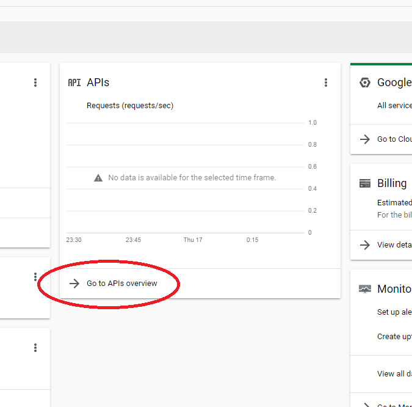
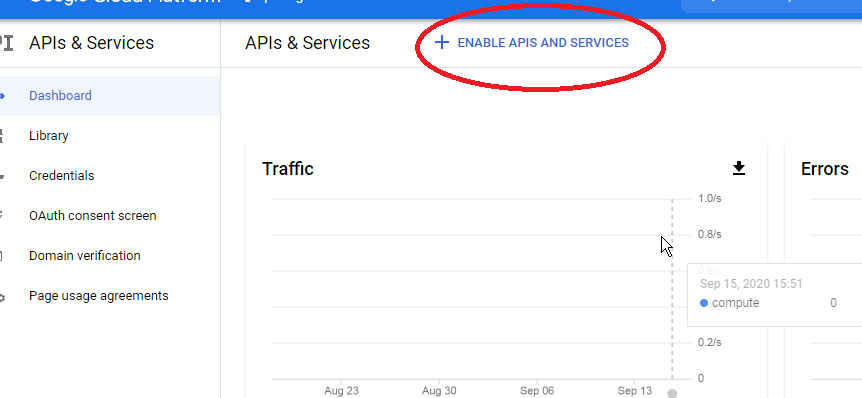
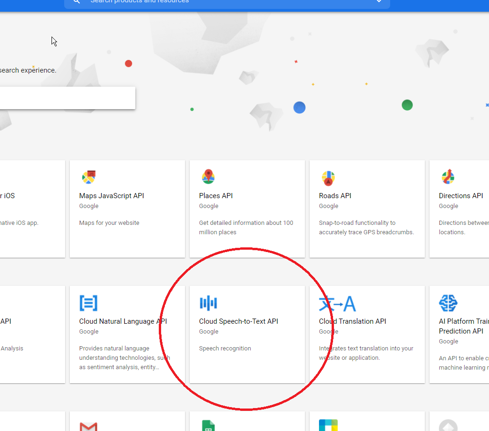
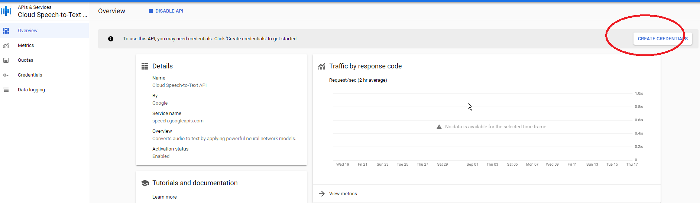
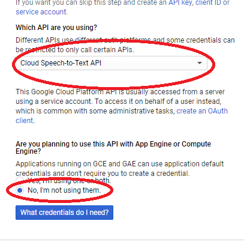
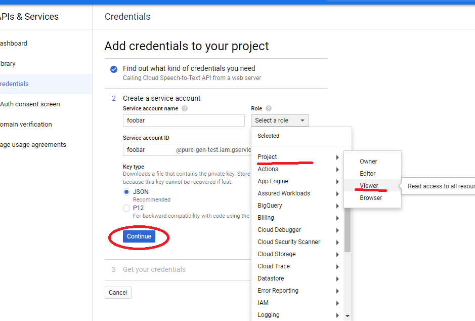
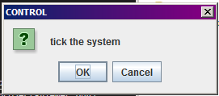

> I have only tested this on Windows, so, there are likely parts of it that will fail on Linux/macOS.
>
> File a ticket!
>

You will need a physical microphone (compatible with the Java Media Framework ... which all seem to be) and a few software packages to run this.
Once those are set up, you can run the demonstration agent and get started "hacking on it" as folks say.

# Short Version (REALLY try this first)

```bash
$ javac --version
$ java --version
```

Both need-need to be 11 or later for this to work.
If they are not, update them.

```bash
$ purs --version
$ spago version
```

These should be 0.13.8 and 0.15.2 respectively.
If they are not (or the command fails) install them with `npm`.

... and if `npm` is not available - install Node.JS.

```bash
npm install -g purescript
npm install -g spago
```

If something went wrong ... there's a longer version of setup below.

[... otherwise, just download and launch](INSTALL.md#download--launch).

----

# Installation (only if the short version didn't work)

- [SDKs](#sdks)
	- [Isolated (Windows only?)](#isolated-windows-only)
	- [Integrated (easiest?)](#integrated-easiest)
- [Google ASR Credentials](#google-asr-credentials)
- [Download & Launch](#download--launch)
- [Trouble Shooting](#trouble-shooting)
	- [GOOGLE_APPLICATION_CREDENTIALS](#google_application_credentials)
	- [TargetDataLine](#targetdataline)
	- [XSLT 'void' to 'boolean](#xslt-void-to-boolean)
	- [XTSE0280: Element name *|text() is not a valid QName](#xtse0280-element-name-text-is-not-a-valid-qname)

Most of this system builds and runs as an [sbt](https://www.scala-sbt.org/) project, other than the PureScript build tools.
This means that if you have the Java SDK setup correctly, sbt usable from the command line, and the PureScript tools; you won't need to install any other software to use this program.
In addition to the SDKs, I need you to provide a credentials file named `pureGen-gasr.json` in your user home to specify how the system should connect to Google's speech recognition services.
With the SDKs and speech recognition setup, it's a case of downloading the project, and "running" it through [sbt](https://www.scala-sbt.org/) which should perform all compilation.

## SDKs

The system specifically needs version 11 of the JDK for the graal-js engine that is used to execute compiled PureScript.
To compile PureScript, one needs the PureScript and Spago packages installed via the Node Package Manager in Node.JS.
The project workspace contains a `.bat` file to launch `sbt`, but, if you're not using Windows you should [ensure that the `sbt` tool is installed.](https://www.scala-sbt.org/)
You can check (from the command line) by running these commands;

- run `javac --version` and look for `javac 11.0` or later
- run `java --version` and look for `openjdk 11.0` or later
- run `npm --version` - I see 5.6.0, but, earlier ones that can find spago are likely fine
- run `purs --version` to check that 0.13.8 (or later?) is installed
- run `spago version` to check that 0.15.2 (or later?) is installed
- check that `sbt` works

If it looks like everything is installed, skip [to the section on Google ASR Credentials](#google-asr-credentials) and continue.

If not; you need to choose between an "Isolated" and an "Integrated" installation of the tools.
The Isolated variant avoids changing the system or leaving a footprint, but, it might be undesirable for some people.
The Integrated approach is the traditional or installing updated packages as normal, but, in my experience, this is usually not an option on corporate or university computers.
The steps involved are detailed in the flow chart below, and, fully detailed in the instructions that follow.


### Isolated (Windows only?)

This will likely be the best option if you're using a University computer where your privileges are limited or a work computer where you don't want to interfere with Node.JS settings.
(You'll still have a bunch of `.jar` files that `.ivy` leaves behind ... I'm not sure how to help with that yet. [This post discusses a way around this](https://stackoverflow.com/questions/3142856/how-to-configure-ivy-cache-directory-per-user-or-system-wide))

The whole exercise is a bit redundant if you can't use an audio recording device - so check that first.
(I tried this with whatever our Citrix system was/is and wasn't able to get the camera)

0. make some folder for working in - I used `puregen-sandbox/` on my desktop
1. download the/a `.zip` of OpenJDK11 and unpack it somewhere like `puregen-sandbox/jdk-11.0.8.10-hotspot`
	- check that `puregen-sandbox/jdk-11.0.8.10-hotspot/bin/javac.exe` is a real file
2. download the/a `.zip` of Node.JS and unpack it somewhere like `puregen-sandbox/node-v12.18.3-win-x64`
	- check that `puregen-sandbox/node-v12.18.3-win-x64/npm.cmd` is a real file
3. you'll need to add those to the `%PATH%` variable within a session; I do this with a `.bat` file and assume you will too.
	- create the file `puregen-sandbox/setup.bat` and edit it to be;
		```bat
		SET PATH=%~dp0\jdk-11.0.8+10\bin;%PATH%
		SET PATH=%~dp0\node-v12.18.3-win-x64;%PATH%
		```
	- remember; you might have to go into folder options (or whatever) and untick "Hide File Extensions" to tell Windows that you meant `.bat` not `.txt`
4. `SHIFT` + `RIGHT CLICK` on (or in) the folder and select `open command window here` or `open powershell here`
5. run your `.bat` file to set up the environment variables
	- ... and then check `javac --version`
6. install purescript and spago
	- `npm install -g purescript` will install purescript into the copy you made above
	- `npm install -g spago` will install spago into the copy you made above

### Integrated (easiest?)

This relies on your PC having JDK11 and Node.JS installed and you not being worried about extra packages threatening Node.JS.

It goes;

1. install [JDK11](https://adoptopenjdk.net/) or later and [sbt](https://www.scala-sbt.org/)
2. check that JDK11 is "the JAVA" and update `PATH` or uninstall "other Java" until it is
	- run `javac --version` and look for `javac 11.0` or later
	- run `java --version` and look for `openjdk 11.0` or later
	- check that `sbt help` produces sensible output
3. check that `npm --version` indicates ... some version of npm
	- run `npm --version` - I see 5.6.0, but, earlier ones that can find spago are likely fine
4. install PureScript and Spago globally
	- `npm install -g purescript` should install purescript globally; locally didn't work for me
	- `npm install -g spago` should install spago globally; locally didn't work for me

## Google ASR Credentials

> This won't be needed iff you're part of the study and Peter has sent you a `pureGen-gasr.json`

> You can also skip this step, and follow [the tutorial](TUTORIAL.md) and not use the GoogleASR.

The system uses Google's Cloud Automatic Speech Recognition (GASR? - I'm calling it GASR) for its primary real-time speech recognition.
There is the option to use [CMU Sphinx 4](https://github.com/cmusphinx/sphinx4) but it is not nearly as precise.

To connect to GASR, the system reads a credentials file containing a JSON object with some authentication data.
This file stored outside of version control (for obvious reasons) and will be provided by Peter for the evaluation.

Usage of GASR is metered by the minute, but, IME - I haven't exceeded the "free daily allowance" of 60 minutes.
There was an advert giving some amount of free credit for 90 days - I haven't "used" that up.
If you're coming to this "later" and wish to use the GASR yourself, you can setup a project yourself.

> Somewhere along the way, Google Cloud will ask you to connect billing stuff.
> I've already done that, so, I wasn't asked when writing this guide.
> I don't remember where this was set up - I don't believe that it was at all confusing though.

1. create the project
	- remember; you'll have to do something with billing
	1. set up an account to the point where you can [login to the Google Cloud Platform https://console.cloud.google.com/](https://console.cloud.google.com/)
	2. create a [new project](https://console.cloud.google.com/projectcreate)
2. turn on cloud text to speech for your project
	1. open the API Overview thing 
	2. open the "Enable APIs" thing along the top 
	3. open the "Cloud Speech to Text" control 
	4. enable it 
		- this will lead you to an overview page for creating credentials
3. create some credentials
	- from the above, you'll go to a credentials page
	1. select cloud to speech and "no - we're not using compute" 
	3. set it up as a project viewer, give it a name, and click continue 
	4. it'll download a `.json` file for you - that's the thing that you want!
4. put the file in the correct place
	1. rename it `pureGen-gasr.json`
	2. put it in your home directory

## Download & Launch

[Download and unzip the evaluation release](https://github.com/g-pechorin/pure-gen/archive/master.zip) into a folder.

Open a command line in the `fud14.pure-gen.sbt/` folder.
If you're using the **Isolated** approach - you need to run your `setup.bat` now.
Run the command `sbt demo/run` to launch the Parrot Demo; it will take a while as it has to download quite a few packages.
At some point, a JSwing dialogue will pop up;



- `OK` cycles the system
	- there will be no "events" but the system is run anyway.
- `Cancel` (or `x`) closes the system
	- this currently is incomplete and crashes gracelessly but safely

Talking at your computer should result in speech recognition being performed and the results being repeated.
If you see error messages and crashes - something went wrong.

## Trouble Shooting

### GOOGLE_APPLICATION_CREDENTIALS

If you get an error at startup with a message containing ...

```
Error reading credential file from environment variable GOOGLE_APPLICATION_CREDENTIALS
```

... then the file `pureGen-gasr.json` is not in your user home directory.

Put the file there.

### TargetDataLine

If you get an error at startup with a message containing ...

```
No line matching interface TargetDataLine supporting format ...`
```

... then the system as unable to find a microphone.

Plugin your camera or microphone.

### XSLT 'void' to 'boolean

If you get an error at startup with a message containing ...

```
FATAL ERROR:  'Cannot convert data-type 'void' to 'boolean'.'
				   :Cannot convert data-type 'void' to 'boolean'.
```

Then "the old bug" is back and the MaryTTS XSLT has gone wrong.

### XTSE0280: Element name *|text() is not a valid QName

Seeon on;
- Windows 7 x64
- IDEA

Solution;
- run fromt eh command line

```
Static error at xsl:strip-space on line 36 column 41
  XTSE0280: Element name *|text() is not a valid QName
>>>>>>>>>>>>>>>>>>>>>>>>>>>>>>>>>>>>>>
>>>>>>>>>>>>>>>>>>>>>>>>>>>>>>>>>>>>>>
>>>>>>>>>>>>>>>>>>>>>>>>>>>>>>>>>>>>>>
!
! Cannot start MARY server
!
======================================
======================================
Cannot start MARY server
	at marytts.LocalMaryInterface.<init>(LocalMaryInterface.java:66)
	at peterlavalle.puregen.MaryTalk$.apply(MaryTalk.scala:15)
	at peterlavalle.puregen.MaryLive$$anon$1.<init>(MaryLive.scala:22)
	at peterlavalle.puregen.MaryLive$.kirk(MaryLive.scala:21)
	at peterlavalle.puregen.TryMary.$anonfun$openLiveMary$1(TryMary.scala:16)
	at peterlavalle.puregen.Cyclist.p(Cyclist.scala:68)
	at pidl.B.$anonfun$apply$1(T.scala:48)
	at peterlavalle.puregen.include$ScriptedGen$$anon$2.apply(include.scala:28)
	at <js> :=>(Unnamed:6:153-166)
	at <js> :=>(Unnamed:367:11146-11168)
	at <js> __do(Unnamed:451:13926-13952)
	at <js> __do(Unnamed:604:19591-19619)
	at <js> __do(Unnamed:721:23480-23492)
	at org.graalvm.polyglot.Value.execute(Value.java:454)
	at peterlavalle.puregen.include$ScriptedValue.$anonfun$eff$2(include.scala:124)
	at peterlavalle.puregen.DemoTry$.$anonfun$runAgent$5(DemoTry.scala:140)
	at peterlavalle.include$$anon$2$$anon$3.run(include.scala:117)
Caused by host exception: marytts.exceptions.MaryConfigurationException: Cannot start MARY server
======================================

caught an exception during the setup

<<<<<<<<<<<<<<<<<<<<<<<<<<<<<<<<<<<<<<
<<<<<<<<<<<<<<<<<<<<<<<<<<<<<<<<<<<<<<
<<<<<<<<<<<<<<<<<<<<<<<<<<<<<<<<<<<<<<
Exception in thread "Thread-9" java.lang.IllegalStateException: MARY system is not running
	at marytts.server.Mary.shutdown(Mary.java:371)
	at marytts.server.Mary$2.run(Mary.java:290)
```
